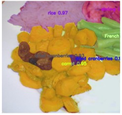
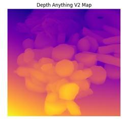

# 🍽️ CaloryCal

### AI-Based Food Calorie Estimation from a Single Image

---

## 📌 Overview

**CaloryCal** is an AI-powered system that estimates the caloric content of food from a single image. The system combines **instance segmentation**, **depth estimation**, and **relative nutritional modelling** to produce **per-item calorie estimates**, rather than treating the entire plate as a single unit.

The project has progressed beyond proof-of-concept and now demonstrates a **complete end-to-end pipeline**, with current limitations primarily related to **data quality and class imbalance**, not model capability. :contentReference[oaicite:0]{index=0}

---

## 🎯 Key Features

* 🍛 **Food Detection & Segmentation** using YOLO segmentation  
* 📏 **Portion Size Estimation** using depth maps  
* ⚖️ **Relative portion-based calorie estimation** using segmentation and depth  
* 🧠 **Data-centric optimisation strategy** (handling long-tail distribution)  
* 📱 **Planned mobile deployment (iPhone-first approach)**  
* 🧩 **Future integration with SAM (Segment Anything Model)** for refinement  

---

## 🏗️ System Pipeline

```
Input Image
     ↓
Food Segmentation (YOLO)
     ↓
Depth Estimation (Depth Anything V2)
     ↓
Mask Area + Depth Statistics Extraction
     ↓
Relative Portion Estimation (Size Score)
     ↓
Normalisation & Portion Classification (small / medium / large)
     ↓
Calorie Estimation (Base Calories × Portion Scale)
```

---

## 🧮 Calorie Estimation Model

The current system estimates calories using a **relative portion-based approach**, rather than true physical volume.

### Step 1 — Relative Size Score

```
size_score = pixel_area × depth_median
```

---

### Step 2 — Normalisation

```
size_score_norm = size_score / max(size_score)
```

---

### Step 3 — Portion Classification

- small (< 0.33)  
- medium (< 0.66)  
- large (≥ 0.66)  

---

### Step 4 — Calorie Estimation

```
portion_scale = 0.5 + size_score_norm
estimated_calories = base_calories × portion_scale
```

---

### Example Calorie Reference

```python
calorie_reference = {
    "rice": 206,
    "bread": 80,
    "tomato": 22,
    "chicken duck": 239,
    "pizza": 285,
    ...
}
```

---

## 📸 Example Results

### Segmentation Output


### Depth Estimation


---

## 📊 Model Performance

| Metric        | Value |
|-------------|------|
| Box mAP50    | 0.376 |
| Box mAP50–95 | 0.316 |
| Mask mAP50   | 0.378 |
| Mask mAP50–95| 0.301 |

**Interpretation:**
- The model is **functionally stable**
- Performance is limited by **data quality**, not architecture
- Segmentation errors directly impact calorie estimation accuracy

---

## ⚠️ Current Limitations

The current system uses **relative depth and pixel-based scaling**, not real-world measurements.

As a result:
- Depth values are not in physical units (cm or mm)
- Portion estimation is relative within the same image
- Calorie estimates are scaled approximations, not exact values

This design is intentional at the prototype stage to validate the pipeline before introducing calibrated measurements.

---

## 🧠 Methodological Choice

Instead of directly estimating physical volume, this project adopts a **data-centric relative estimation approach**:

- segmentation quality is prioritised over geometric assumptions  
- relative depth is used to rank portion sizes  
- calorie estimation is scaled based on intra-image comparison  

This reduces error propagation from inaccurate depth scaling and improves robustness in uncontrolled real-world conditions.

---

## ⚠️ Key Challenges

* Long-tail class distribution (FoodSeg103 dataset)  
* Visually ambiguous categories (e.g., sauces, mixed food)  
* Label noise and segmentation boundary errors  
* Class imbalance affecting rare food detection  

---

## 🚀 Future Work & Roadmap

### Phase 1 — Data-Centric Optimisation
* Introduce **On-the-Fly Balanced Sampling**  
* Reduce class space to high-impact food categories  
* Improve annotation quality and dataset coverage  

### Phase 2 — Inference Pipeline
* Build lightweight inference module  
* Separate training from deployment  

### Phase 3 — Mobile Deployment (iPhone First)
* Use **LiDAR / depth APIs**  
* Enforce controlled capture:
  - top-down image  
  - plate alignment zone  
* Improve real-world reliability  

### Phase 4 — Segmentation Refinement
* Integrate **SAM (Segment Anything Model)**  
* Improve:
  - boundary precision  
  - overlapping food separation  

### Phase 5 — System Expansion
* Expand food categories  
* Improve generalisation  
* Replace proxy size estimation with **true geometric modelling**  

---

## 📂 Project Structure

```
CaloryCal/
│
├── notebooks/
├── src/
├── models/
├── data/
├── results/
├── docs/
└── README.md
```

---

## ⚙️ Installation

```bash
python -m venv env
source env/bin/activate  # or env\Scripts\activate on Windows
pip install -r requirements.txt
```

---

## ▶️ Usage

```python
from ultralytics import YOLO

model = YOLO("models/best.pt")
results = model("data/sample_images/test.jpg")

img = results[0].plot(boxes=False, labels=True, conf=False)
```

---

## 🧪 Technologies Used

* YOLO (Ultralytics) — segmentation  
* Depth Anything V2 — depth estimation  
* Python / PyTorch  
* FoodSeg103 dataset  

---

## 📖 Documentation

Full proposal available in `/docs`, including:
- system architecture  
- experimental results  
- data-centric strategy  
- implementation roadmap  

---

## 💡 Research Contribution

> **The main bottleneck of the system is not model architecture, but data quality, class imbalance, and label consistency, making this a fundamentally data-centric computer vision problem.**

CaloryCal demonstrates that effective food calorie estimation depends more on **data structure and representation** than on increasing model complexity.

---

## 🧭 Future Vision

* Real-time mobile calorie estimation  
* Integration with nutrition APIs (e.g., USDA)  
* Personalised dietary tracking  
* Clinical and healthcare applications  

---

## 👤 Author

**Madawi Alsoyohi**  
Data Scientist  

---

## ⭐ Final Note

This project bridges **computer vision** and **nutritional intelligence**, transitioning from a research prototype into a **deployable real-world system**.
